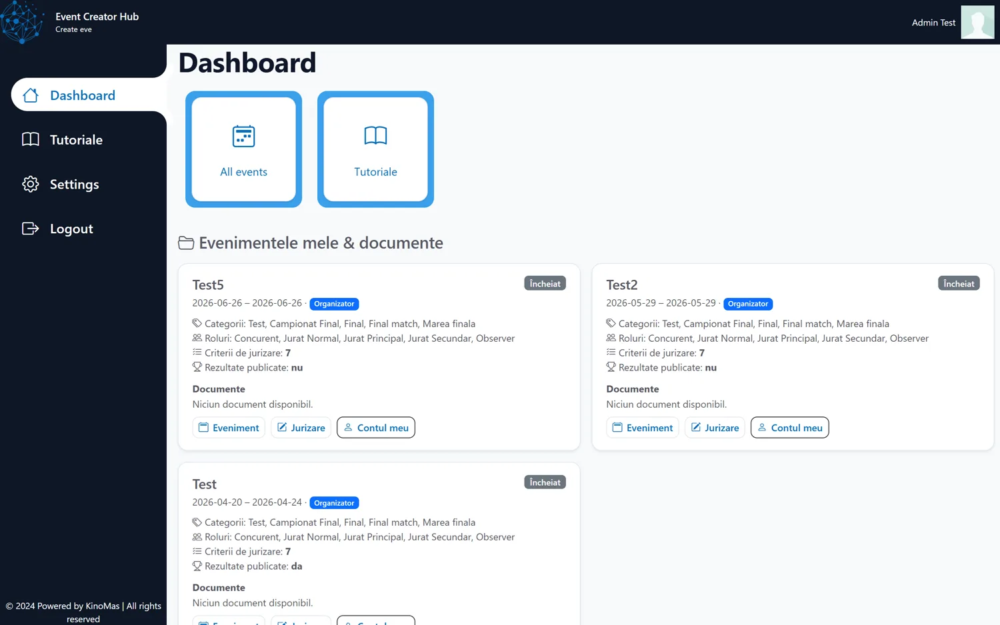
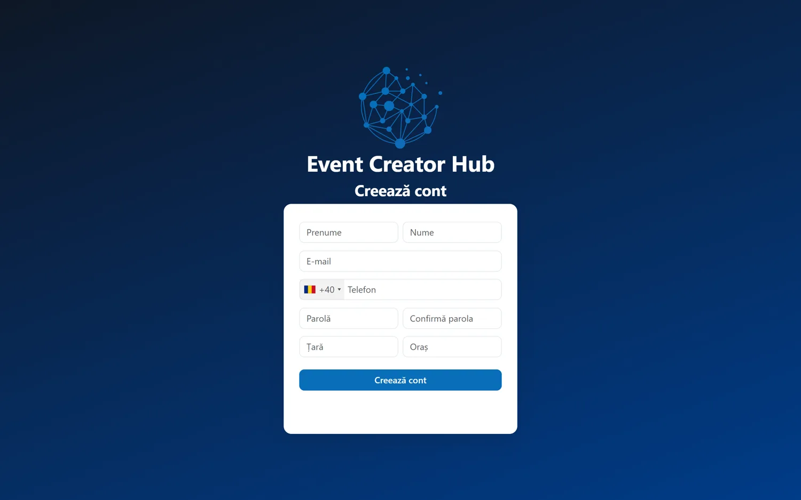
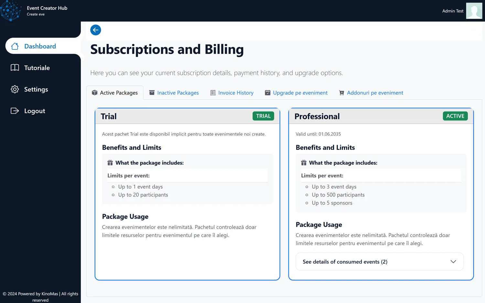

# Event Creator Hub

**A web platform for running scored competitions and events** — paperless digital judging, real-time scoreboards, competitor allocation, and built-in communication (chat, WhatsApp, notifications).

Live: **[eventcreatorhub.com](https://eventcreatorhub.com)**. Modular, multilingual, with usage-based pricing (per user / per event day).

> Closed-source commercial product. This page is a showcase; screenshots are from a demo/test account.

---

## What it does

**Event management**
- Create and configure events, categories, disciplines and roles

**Digital judging** *(the centerpiece)*
- Per-judge terminal, scoring by criteria, electronic signature
- Round finalization and final rounds, access checks (event owner or assigned judge)

**Real-time scores & standings**
- Live points lists, contestant and judge views, contestation handling

**Allocations**
- Assign competitors to disciplines / rooms / beds, manual reallocation, model ↔ user mapping

**Communication**
- Per-event internal chat
- WhatsApp — send results to competitors + contact form (third-party API **and** a self-hosted Baileys gateway with QR onboarding)
- Notifications over Platform / Email / SMS with a device gateway and GDPR consent

**Business**
- Subscriptions & add-ons (extra users / days / sponsors), Oblio invoicing
- Secure document upload/download (S3), sponsors, feedback, tutorials
- Admin panel, roles & permissions

## Tech stack

| Layer | Technology |
|---|---|
| Backend | PHP 8.2 (procedural), MySQLi with prepared statements |
| Database | MySQL / MariaDB (`ECH_*` tables) |
| Frontend | Bootstrap 5.3, Bootstrap Icons, jQuery, JSON-LD SEO |
| Payments | Stripe (checkout + webhooks), Oblio (RO invoicing) |
| Messaging | UltraMSG + self-hosted Baileys WhatsApp gateway, PHPMailer/SMTP |
| Storage | Wasabi / S3 with 3-tier least-privilege keys (uploader / reader / admin) |
| i18n | `ro` / `en` dictionaries switched per user |

## Engineering highlights

- **Signature-backed judging engine** — per-criterion scoring, owner/judge access verification, base64 → PNG signatures, final-round locking.
- **Security hardening** — migration to prepared statements, ownership checks (`ech_require_event_owner`), CSRF guards, and phone lookups scoped to event participants only (no PII leakage).
- **Dual WhatsApp** — third-party API plus an own DB-driven Baileys gateway with a self-service QR flow.
- **Least-privilege storage** — separate Wasabi keys per operation, presigned URLs.
- **Subscription/add-on engine** — dynamic per-event catalog with Oblio invoicing.

## Screenshots

From a test account; all events shown are test data (no real participant PII).

| | |
|---|---|
|  |  |
| **Landing** | **Dashboard** — events with categories, judge roles & scoring criteria |
|  |  |
| **Registration** — with international phone input | **Subscriptions & billing** — packages, add-ons, invoices |

---

**Role:** Founder & sole engineer.
