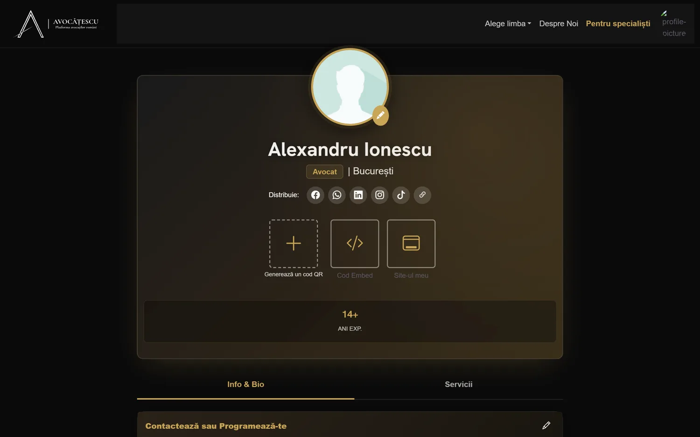
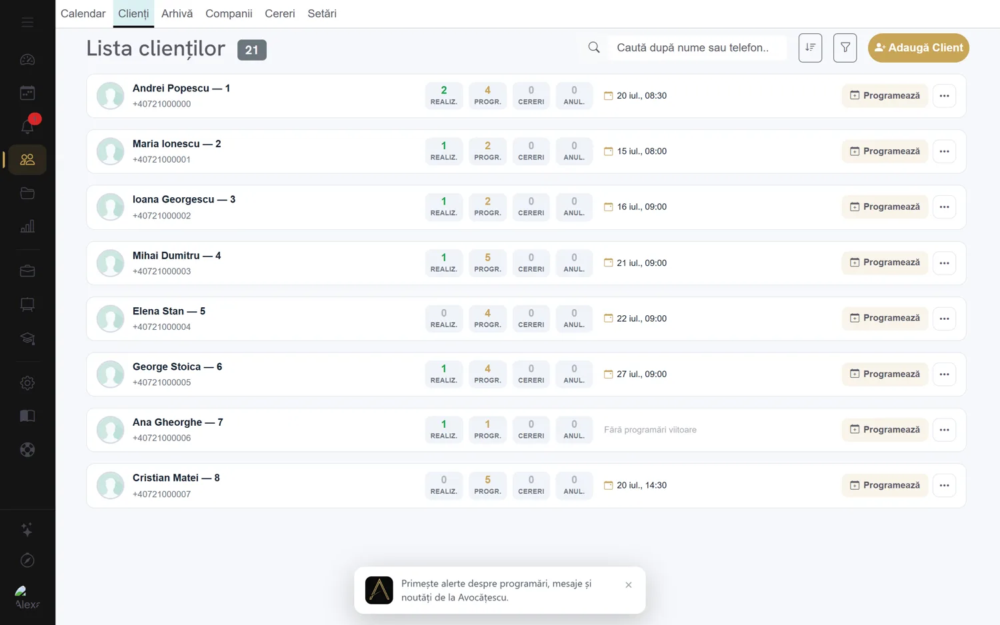
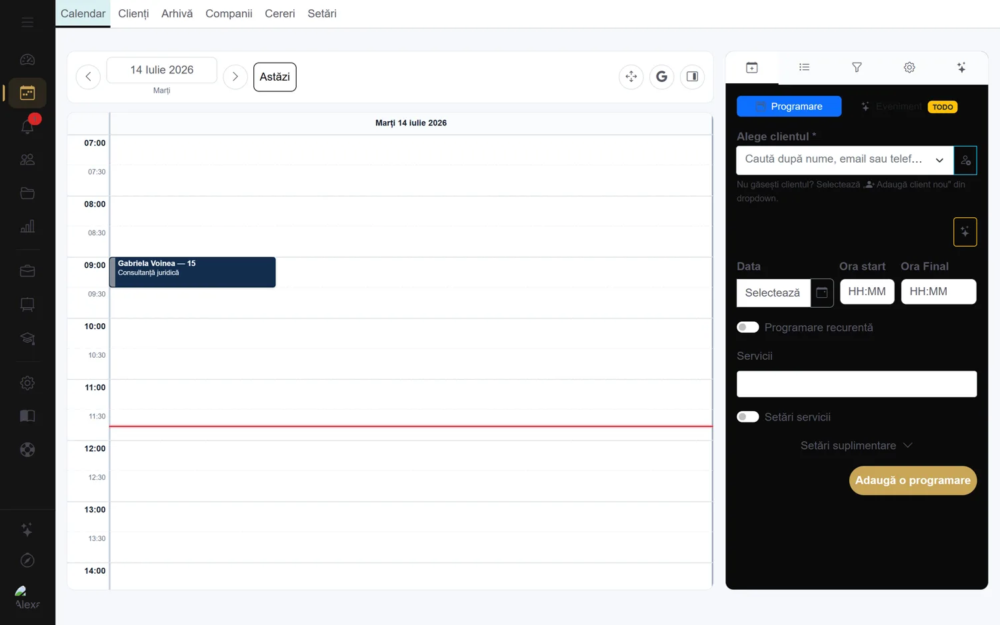
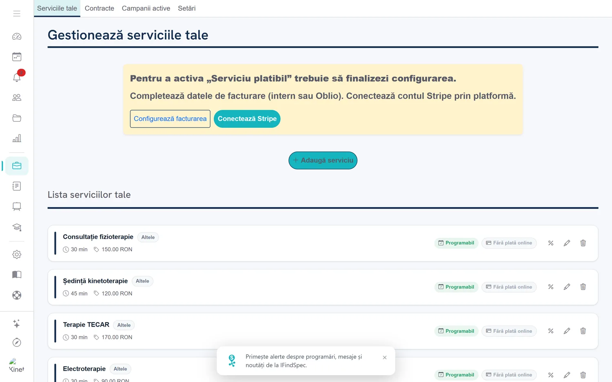
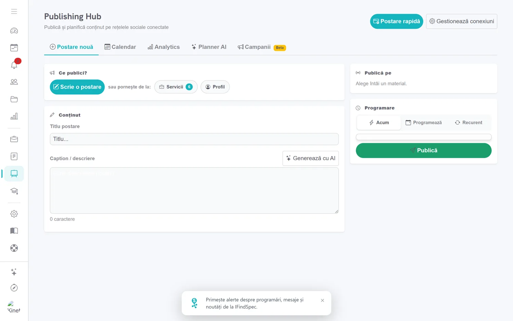
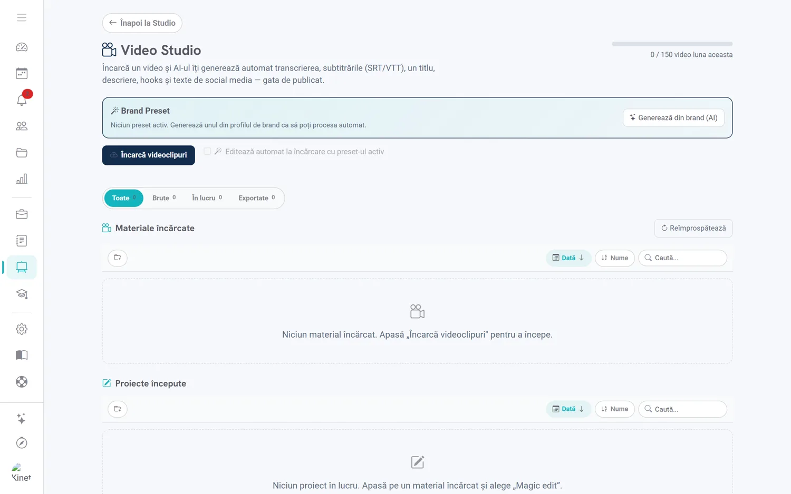
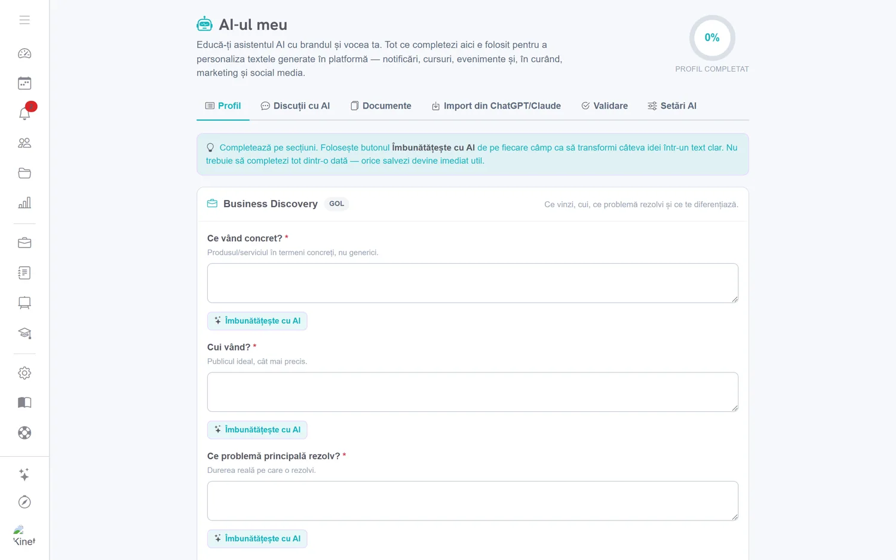

# IFindSpec / Avocatescu

**All-in-one practice-management SaaS for independent professionals and service businesses.**
One codebase, dual-branded: **[ifindspec.com](https://ifindspec.com)** (general specialists — doctors, physiotherapists, consultants) and **[avocatescu.ro](https://avocatescu.ro)** (lawyers, with a dedicated legal module).

It covers the whole lifecycle — *get discovered → book → deliver → invoice → market* — plus a public marketplace where clients find and contact specialists.

> Closed-source commercial product. This page is a showcase; screenshots below are from a demo account (no real client data).

---

## What it does

**Clients & scheduling**
- Client/company CRM, appointment calendar, booking requests
- Per-client files & documents (stored on Wasabi/S3)

**Services, packages & contracts**
- Service catalog, packages with slot tracking
- Contracts with installment payments and automated reminders

**Finance & invoicing**
- Financial ledger with charted statistics, cashier (with storno/refund lifecycle)
- Accountant portal (ZIP export), Oblio invoicing

**Payments**
- Stripe subscriptions + Stripe Connect marketplace (creator → client)

**Video Studio** *(media pipeline)*
- YouTube → vertical 9:16 clips (Submagic-style): speech-to-text, auto-captions, editor
- Voice dubbing / translation in ~40 languages, ffmpeg rendering on a worker
- AI video generation (fal.ai)

**Creative & social marketing**
- Creative Studio (AI images / GIF / MP4)
- Publishing Hub — multi-platform social composer (Meta / Instagram / TikTok)
- Monthly AI content planner, Meta Ads, social analytics
- Email marketing (Brevo)

**AI throughout**
- "My AI" brand-voice profile injected into generation
- Compose / rewrite assistant in the editor (TipTap)
- Chat assistant with **tool-calling** — creates clients, appointments and services on live data
- Medical lab-result interpretation, AI-assisted data import

**More**
- Video conferencing V2 (whiteboard + breakout rooms)
- Learning hub (course/quiz Studio + Academy), paid-materials vault
- AI landing-page builder (`/site/{slug}`), PWA with push notifications
- Legal tooling for avocatescu.ro (Monitorul Oficial ingestion, AI drafts)
- CNAS/SIUI medical reporting (F4)

---

## Tech stack

| Layer | Technology |
|---|---|
| Backend | PHP 8.2 (procedural, framework-free), nginx |
| Database | MariaDB + a custom migration system |
| Frontend | Vanilla JS, TipTap, Flatpickr, Chart.js, Shepherd.js, GrapesJS |
| Node services | image generator, video/render worker, PDF, company search, WhatsApp gateway (pm2) |
| Payments | Stripe, Stripe Connect, Oblio |
| Storage / media | Wasabi (S3), ffmpeg |
| Integrations | Google (Calendar / OAuth / Business Profile), Meta, Instagram, TikTok, YouTube, WhatsApp, Brevo |
| AI | Gemini, Claude (multi-model routing + tool-calling), fal.ai |

## Engineering highlights

- **Test ↔ production via MariaDB VIEWs** — the test database mirrors production through auto-refreshed views, giving a zero-risk isolated environment for writes.
- **Centralized dual-branding** — a single codebase serves two domains/brands through an `.env` switch.
- **Media pipeline** — VAD-based speech-to-text, WYSIWYG captions, multilingual dubbing, ffmpeg rendering on pm2 workers with queues, dedup and a disk reaper.
- **AI tool-calling** — the assistant performs real CRUD actions via per-scope key routing.
- **Autoscaling** — Hetzner instances scale up/down (Python + systemd), with heavy jobs offloaded to a separate box.
- **Automatic i18n** — a `t()` function with on-demand AI translation cached in the database.

## Screenshots

From seeded demo accounts (no real client data). The UI is Romanian — this is a Romanian-market product.

| | |
|---|---|
|  |  |
| **Public specialist profile** — shareable page, QR/embed, booking | **Client CRM** — clients with per-client appointment stats |
|  |  |
| **Calendar & booking** — day view with in-panel booking | **Services** — catalog with duration, price, online-payment flags |
|  |  |
| **Publishing Hub** — social composer with AI captions & scheduling | **Video Studio** — auto captions, dubbing, AI social copy |
|  | |
| **"My AI"** — train the assistant on your brand & voice | |

---

**Role:** Founder & sole engineer — architecture, backend, frontend, AI, media, payments and infrastructure.
