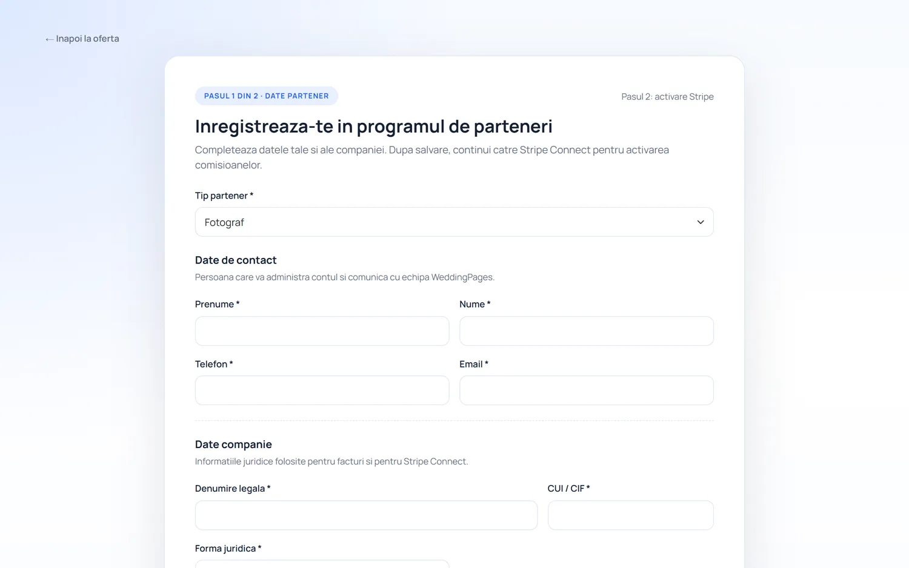

# WeddingPages

**A dynamic wedding-site builder** — couples create a mini-site (digital invitation, RSVP, seating plan, a guest "wall of fame" photo feed, SMS/QR invites) — plus a **partner/venue portal** with bulk ordering, coupons and Stripe Connect checkout, and an admin back-office.

Live: **[weddingpages.ro](https://weddingpages.ro)**. Each individual wedding site is provisioned as its own subdomain on a separate cPanel/Hestia host.

> Closed-source commercial product. This page is a showcase; screenshots are from demo/test data.

---

## What it does

**For couples**
- Marketing landing + couple onboarding
- Dynamic event site: digital invitation, RSVP, seating plan, guest photo "wall of fame" (media on Wasabi/S3)
- SMS invitations via an Android device gateway with a send queue

**Partner / venue portal**
- Two-step partner registration, dashboard
- Bulk orders of wedding pages, coupon validation, checkout
- Stripe Connect onboarding (payouts), venue invitations

**Back-office**
- Admin panel and offers management
- Oblio invoicing (invoice + storno by email)

## Tech stack

| Layer | Technology |
|---|---|
| Backend | PHP 8.2 (procedural), PDO / MariaDB |
| Frontend | Bootstrap 5.3, Playfair Display + Manrope |
| Routing | nginx clean-URLs (`try_files $uri $uri/ $uri.php`) |
| Payments | Stripe Connect, Oblio |
| Storage | Wasabi S3 (SigV4, validated bucket/key builder) |
| Messaging | Own SMS gateway (authenticated Android device) |

## Engineering highlights

- **Automatic per-wedding subdomain provisioning** through the cPanel/Hestia API.
- **SMS queue with a physical device** authenticated via `device_id` / `device_secret` and `hash_equals`.
- **Wasabi S3 SigV4 storage** with validated buckets and a safe key builder.

## Screenshots

Public portal pages. The individual wedding-site view is provisioned per couple on a separate host and isn't shown here.

| | |
|---|---|
|  |  |
| **Landing** — "Your story, told digitally" | **Full marketing page** — features, pricing, contact |
|  |  |
| **Partner registration** — venue/supplier onboarding | **Partner login** |

---

**Role:** Founder & sole engineer.
